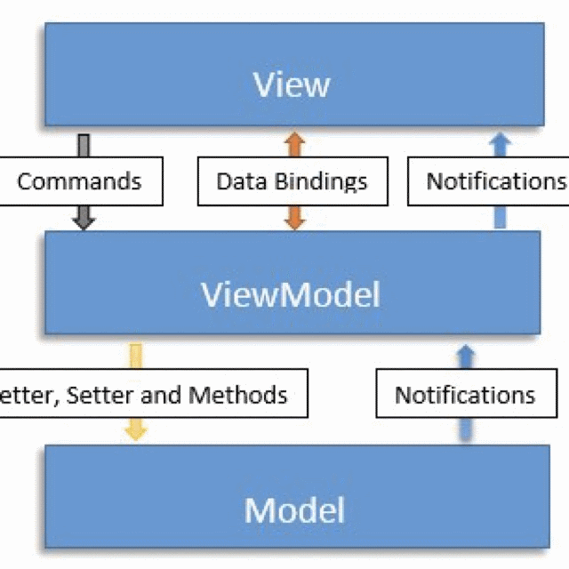
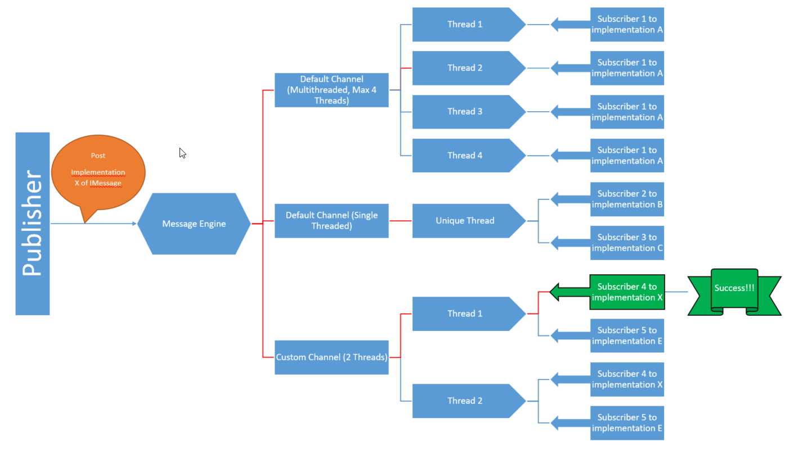

# DMVVM-ES



<br/>
<div>
  <!-- Stability -->
  <a href="https://nodejs.org/api/documentation.html#documentation_stability_index">
    
  </a>
  <!-- Standard -->
  <a href="https://img.shields.io/badge">
    
  </a>
  <!-- Standard -->
  <a href="https://img.shields.io/badge">
    
  </a>
</div>
<br/>

Ejercicios de práctica para tratar de comprender el patrón **MVVM** y quizás terminar con el desarrollo de un pequeño y útil **Framework MVVM** para Delphi.

## Otros frameworks utilizados

* Spring4D
* DUnitX

## Equipo de trabajo

Somos un pequeño grupo de programadores que nos juntamos por Telegram (grupo *Delphi MVVM en Español*) y allí compartimos nuestras ideas y dudas

## Bus de mensajes

Es un bus de mensajes (eventos) basado en el patrón publicador/subscriptor



### Caracteristicas

* Basado en interfaces. Todos los mensajes implementan la interface **IMessage**. Lo normal es que los nuevos mensajes hereden de **TMessage**
* No se realiza clonación de los mensajes al estar basado en interfaces, ni requiere de una destrucción explícita de los mismos.
* Thread Safe
* Qué es el **canal**:
	1. equivalente a un threadpool especializado en la distribución de mensajes a los listeners
	2. puede tener 1 ó 'n' threads
	3. se identifican por un nombre
* Los **subscriptores**:
	1. se subscriben a un canal, ya sea a uno de los existentes o a uno nuevo customizado
	2. se subscriben a un tipo de mensaje (con genéricos), ya sea al tipo base o también al base y heredados (configuración)
	3. pueden filtrar los mensajes para quedarse solo con aquellos de su interés
	4. pueden configurar la ejecución de la recepción del mensaje:
		a. en el main thread
		b. en el thread del bus de mensajes
	5. se configura un método que se llamará cuando un mensaje del tipo 
* Algoritmo:
	1. Cuando se subscribe un listener a un canal (solo puede subscribirse a un canal), se subscribe implicitamente a todos los threads del mismo
	2. Cuando se hace un post de un mensaje:
		a. se pasa el mensaje a todos los canales creados
		b. en cada canal se elige uno de sus threads como transmisor de dicho mensaje, normalmente al que menos mensajes haya transmitido
		c. el thread seleccionado recorre todos los listeners y a aquellos que estén subscritos a ese tipo de mensaje se les pasa el mensaje
		d. el listener puede tener un filtro, por lo que al recibir el mensaje si pasa dicho filtro finalmente se ejecuta el método
* Uso:
	1. Registrar un canal nuevo: 
	   ```delphi
	   MessageBus.RegisterChannel('Channel 1', 2);  // con 2 threads de trabajo
	   ```
	2. Publicar un mensaje:
	   ```delphi
        // Definir mensaje, en este caso transporta un integer
		TTestMessageInteger = class(TMessage)
		public
		Valor: Integer;

		constructor Create(const AValue: Integer); overload;
		end;
		
		//en codigo
		procedure TForm2.Button1Click(Sender: TObject);
		var
		  LMsg: IMessage;
		begin
		  LMsg := TTestMessageInteger.Create(5);
		  LMsg.Post;
		end;
		```
	3. Definir el subscriptor al tipo de mensaje
		```delphi
		//definicion del listener, en la clase donde queremos subscribirnos al mensaje
		TForm2 = class(TForm)
		private
		  ...
		  FListenerInteger  : IMessageListener<TTestMessageInteger>; //interface que define un subscriptor a ese tipo de mensaje
		  ... 
		//en el create de la clase
		FListenerInteger := TMessageListener<TTestMessageInteger>.Create;  //implementacion de listener genérico si no hay necesidad de filtros
		FListenerInteger.IsCodeToExecuteInUIMainThread := True; //se va a ejecutar en el main thread
		FListenerInteger.OnMessage.Add(OnTestMessageInteger); //asignamos el metodo
		
		//en la clase tendremos el método así
		procedure TForm2.OnTestMessageInteger(AMsg: IMessage);
		begin
		  Memo1.Lines.Add(LogTime + 'Integer: ' + TTestMessageInteger(AMsg).Valor.ToString)
		end;
		```

## Links de interes

https://www.youtube.com/watch?v=Ci1HP8ZBJxk

https://blog.grijjy.com/2018/01/22/mvvm-starter-kit-part-1-of-3/
https://github.com/grijjy/MvvmStarterKit

https://bitbucket.org/sglienke/knockoff/src/master/
https://delphisorcery.blogspot.com/2015/06/anonymous-method-overloading.html

https://bitbucket.org/sglienke/dsharp/src/master/
https://github.com/jpluimers/Conferences/blob/master/2015/20151020-DAPUG-Denmark-Nyborg-Hotel-Hesselet/20151020-Caliburn/01-Intro-MVVM-DSharp-Caliburn/MVVM-in-Delphi-using-the-Caliburn-Micro-for-Delphi-framework.md
https://delphisorcery.blogspot.com/2011/12/putting-pieces-together-dsharp.html

https://github.com/msnts/glue

https://github.com/bogdanpolak/command-delphi

https://github.com/mauriziodm/iORM

https://github.com/pmoitaly/BindAPI

https://martinfowler.com/eaaDev/PresentationModel.html

Modificados de Grijjy

https://github.com/DelphiPraxis/MvvmStarterKit/commits/master

https://github.com/nanosystems-srl/MvvmStarterKit

https://github.com/hwhohwh/MvvmStarterKit

https://github.com/bogdanpolak/delphi-dataproxy

View with multiple VM, possible?
https://stackoverflow.com/questions/3259398/multiple-viewmodels-associated-with-a-single-view

https://www.wintellect.com/model-view-viewmodel-mvvm-explained

Otros

https://medium.com/flawless-app-stories/how-to-use-a-model-view-viewmodel-architecture-for-ios-46963c67be1b


## Ideas a tener en cuenta

* Motor permite el registro de distintos tipos de estrategias/métodos de binding
* Posibilidad de habilitar/deshabilitar todos los bindings?

***

### Prototipo 0 (finalizado)

Objetivos:
1. El objetivo no es crear unos modelo-viewmodel-vista maravillosos, por lo que puede no tener excesivo sentido el ejemplo en si mismo
2. El core MVVM debe ser **agnóstico** de la plataforma (vcl/fmx)
3. Debe haber **servicios (UI)** propios a la plataforma, que pueden ser invocados desde cualquiera de los niveles (lo normal desde el VM), se ha creado un servicio sencillo
4. Se ha hecho el ejercicio de crear unos **test unitarios** para el modelo y el viewmodel-vista
5. Se ha creado una vista específica para FMX y otra para VCL, así como una app FMX y otra VCL para probar la funcionalidad
6. En este caso concreto el viewmodel tiene unas funcionalidades similares al propio modelo, vamos que casi hace de puente, por lo que los propios test unitarios son similares
7. A un modelo puede estar linkado un viewmodel (o varios), y este viewmodel puede dar soporte a tantas vistas como se le enganchen
8. La parte del view no está trabajada

### Prototipo 1 (en curso, aún los fuentes visibles son del prototipo.0)

Objetivos:
1. Añadir Motor de Mensajes al sistema: analizar si es mejor que el patrón observer para el modelo    <-- NO
2. Análisis de bindings del motor de grijjy/dsharp/knockoff/Glue para ver qué ideas buenas pueden incorporarse
	a. knockoff: no hay clases especializadas ni interfaces a utilizar en cualquiera de las 3 capas, se utilizan atributos para el binding. Complejo de realizar
	b. glue: parece incompleto, sin ejemplos completos
	c. dsharp: aún no analizado
	d. grijjy: parece el más completo y sencillo de entender para aplicarlo como referencia. Se echan en falta más ejemplos
3. Integrar al core la posibilidad de distintas estrategias de binding, que se puedan registrar
4. Integrar ideas del framework de grijjy (por suerte ellos en su blog dan permiso a utilizar su framework para elaborar otros)
5. El prototipo 1 de momento tendrá una correspondencia de 1-1 entre view y modelview

### Prototipo 2

Objetivos:
1. Crear cliente REST (por generalidad clientes externos a la app) y ver encaje al modelo, qué se puede automatizar, qué no, dificultades,...
2. App tethering: encaja?

